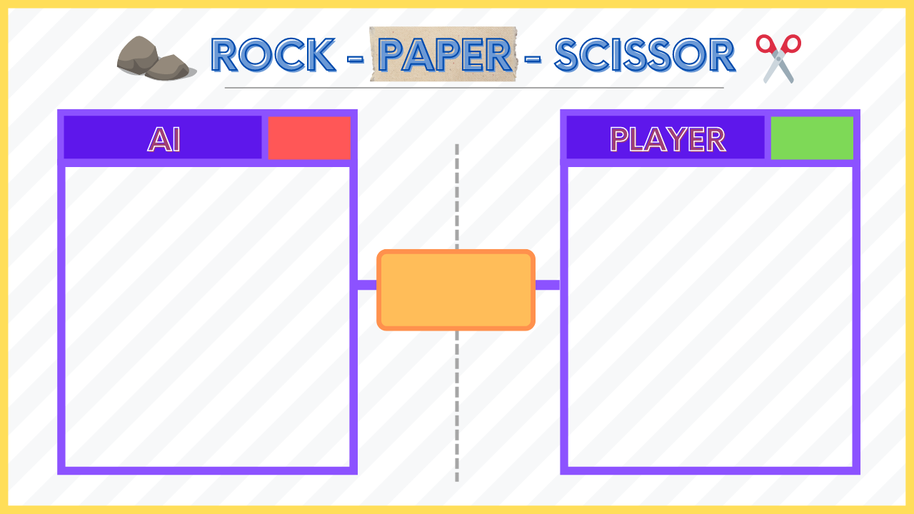

# Rock-Paper-Scissors Game

This is a Rock-Paper-Scissors game built with Python, using OpenCV for webcam input and cvzone for hand gesture recognition. The game allows you to play against an AI, which makes random choices for Rock, Paper, or Scissors.

## Features
- Real-time hand gesture recognition using a webcam.
- Rock, Paper, Scissors game logic implemented with OpenCV and cvzone.
- Score tracking for both AI and the player.
- Simple and fun user interface.

## Demo


## Requirements
To run this project, you'll need the following Python packages:
- `opencv-python`
- `cvzone`

You can install these dependencies using the command:
```
pip install -r requirements.txt
```

## How to Play
- Make sure your webcam is connected.
- Run the Python script:
```
python rock_paper_scissors.py
```
- Press the 's' key to start the game.
- Make one of the following gestures within the 3-second countdown:
  - Rock: Fist (all fingers closed)
  - Paper: Open hand (all fingers open)
  - Scissors: Peace sign (index and middle fingers open)
- The game will display the AI's choice and update the scores based on the result.

## Game Rules
- Rock beats Scissors.
- Paper beats Rock.
- Scissors beat Paper.

## Folder Structure
```
Rock-Paper-Scissors-Game/
├── Resources/
│   ├── BG.png         # Background image for the game interface
│   ├── 1.png          # Image for Rock (AI choice)
│   ├── 2.png          # Image for Paper (AI choice)
│   └── 3.png          # Image for Scissors (AI choice)
├── RPS-CV.py  # Main game script
├── requirements.txt   # Dependencies for the project
└── README.md          # Project documentation
```

## Dependencies
The required Python libraries can be installed using:
```
pip install -r requirements.txt
```

## Contributing
Feel free to submit issues, fork the repository, and send pull requests.

## License
This project is licensed under the Apache License 2.0.

## Acknowledgments
- `OpenCV` for computer vision capabilities.
- `cvzone` for making hand gesture recognition easier.
